# Shopix — Production AWS Deployment

> Full-stack e-commerce platform deployed on production-grade AWS infrastructure with custom VPC, private subnets, Application Load Balancer, RDS MySQL, and a fully automated CI/CD pipeline using GitHub Actions, OIDC, ECR, and SSM — zero static credentials stored anywhere.

---

## Live Demo

**URL:** http://prod-lb-1497452199.us-east-1.elb.amazonaws.com

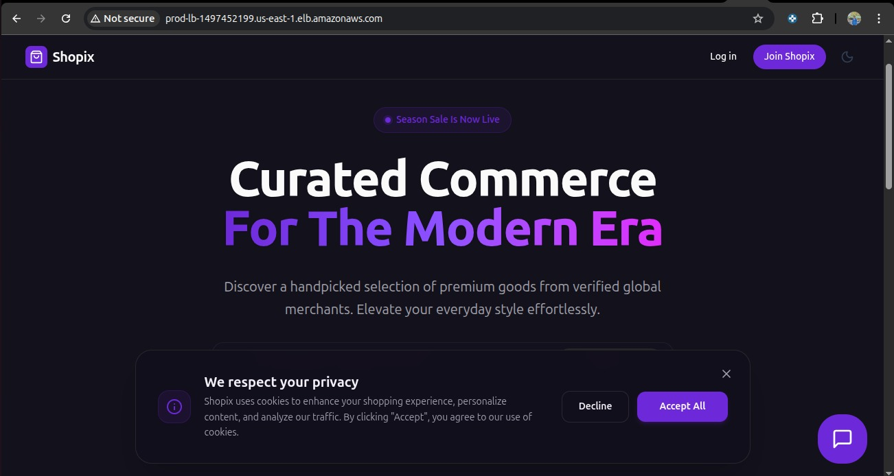
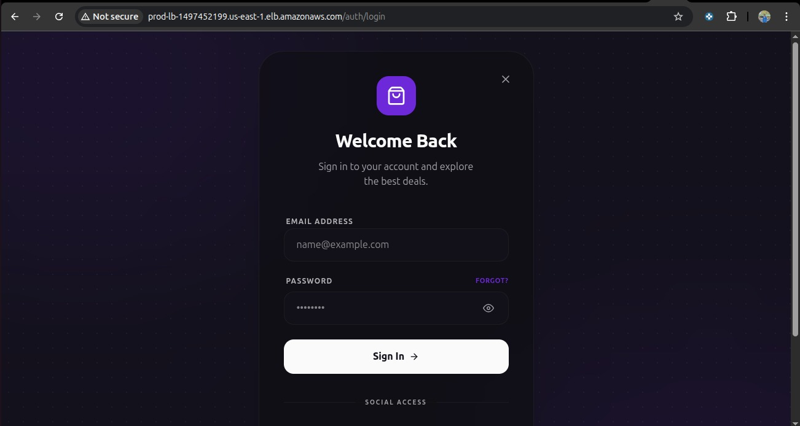

---

## Architecture Overview

```
Internet
    │
    ▼
Application Load Balancer
(public-subnet-1 us-east-1a + public-subnet-2 us-east-1b)
    │                         │
    ▼                         ▼
app-server-1             app-server-2
private-subnet-1         private-subnet-2
us-east-1a               us-east-1b
    │                         │
    └──────────┬──────────────┘
               ▼
          RDS MySQL 8.0
    private-subnet-3 (us-east-1a)
    private-subnet-4 (us-east-1b)
               │
               ▼
         NAT Gateway
     (outbound only — private subnets reach internet)
               │
               ▼
      Internet Gateway → Internet
```

---

## Table of Contents

1. [VPC and Networking](#1-vpc-and-networking)
2. [Security Groups](#2-security-groups)
3. [EC2 Instances and Bastion Host](#3-ec2-instances-and-bastion-host)
4. [RDS Database](#4-rds-database)
5. [Application Load Balancer](#5-application-load-balancer)
6. [IAM Roles and OIDC](#6-iam-roles-and-oidc)
7. [ECR — Container Registry](#7-ecr--container-registry)
8. [SSM — Systems Manager](#8-ssm--systems-manager)
9. [CI/CD Pipeline](#9-cicd-pipeline)
10. [Issues Faced](#10-issues-faced)
11. [Tech Stack](#11-tech-stack)
12. [Key Concepts Demonstrated](#12-key-concepts-demonstrated)

---

## 1. VPC and Networking

Created a custom VPC with CIDR `10.0.0.0/16` and 6 subnets across two availability zones. Nothing shares subnets between the load balancer, app servers, and database.

```
VPC: production-vpc (10.0.0.0/16)
├── public-subnet-1   10.0.1.0/24   us-east-1a   → ALB + NAT Gateway
├── public-subnet-2   10.0.2.0/24   us-east-1b   → ALB
├── private-subnet-1  10.0.3.0/24   us-east-1a   → app-server-1
├── private-subnet-2  10.0.4.0/24   us-east-1b   → app-server-2
├── private-subnet-3  10.0.5.0/24   us-east-1a   → RDS primary
└── private-subnet-4  10.0.6.0/24   us-east-1b   → RDS standby
```

**Route Tables:**

```
public-route-table
├── 10.0.0.0/16  →  local
└── 0.0.0.0/0   →  Internet Gateway (production-igw)
    Associated: public-subnet-1, public-subnet-2

private-route-table
├── 10.0.0.0/16  →  local
└── 0.0.0.0/0   →  NAT Gateway (production-ngw)
    Associated: private-subnet-1, private-subnet-2, private-subnet-3, private-subnet-4
```

**Why NAT Gateway?**
Private EC2 instances have no public IP. NAT Gateway allows them to pull Docker images from ECR, download system packages, reach AWS APIs — outbound only. No inbound traffic can reach private instances directly from the internet.

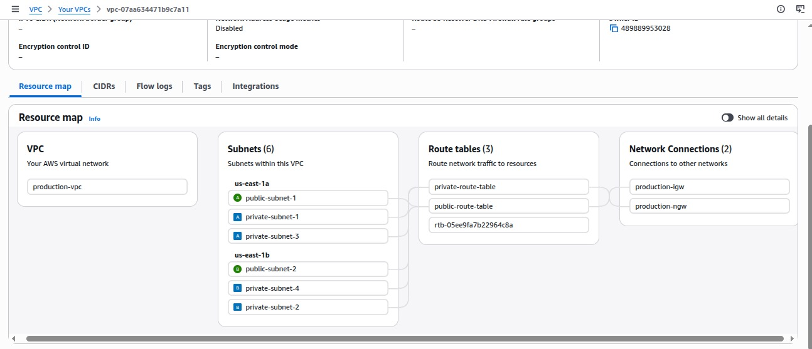

---

## 2. Security Groups

Four security groups with strict rules. Each component only accepts traffic from the exact source it should.

```
alb-sg (Application Load Balancer)
  Inbound:
    HTTP  port 80   from 0.0.0.0/0   ← public internet
    HTTPS port 443  from 0.0.0.0/0   ← public internet
  Outbound:
    All traffic → 0.0.0.0/0

ec2-sg (App Servers)
  Inbound:
    HTTP port 80   from alb-sg       ← only ALB can send app traffic
    SSH  port 22   from bastion-sg   ← only bastion can SSH in
  Outbound:
    All traffic → 0.0.0.0/0

rds-sg (Database)
  Inbound:
    MySQL port 3306  from ec2-sg     ← only app servers reach DB
  Outbound:
    All traffic → 0.0.0.0/0

bastion-sg (Bastion Host)
  Inbound:
    SSH port 22  from <my-ip>/32     ← only my machine
  Outbound:
    All traffic → 0.0.0.0/0
```

**Why use security group as source instead of IP?**
Using `ec2-sg` as the source in `rds-sg` means any EC2 with that security group attached can reach RDS. Both app-server-1 and app-server-2 get access automatically. No manual IP management needed.

---

## 3. EC2 Instances and Bastion Host

Three EC2 instances total. Bastion is the only one with a public IP. App servers are fully private — no direct internet access.

```
bastion-host    public-subnet-1    has public IP    bastion-sg    t2.micro Ubuntu
app-server-1    private-subnet-1   no public IP     ec2-sg        t2.micro Ubuntu
app-server-2    private-subnet-2   no public IP     ec2-sg        t2.micro Ubuntu
```

All three use the same key pair (`production-key.pem`).

**SSH flow into private EC2:**

```bash
# Step 1 — copy key to bastion (run on local machine)
scp -i production-key.pem production-key.pem ubuntu@<bastion-public-ip>:~/.ssh/

# Step 2 — SSH into bastion
ssh -i production-key.pem ubuntu@<bastion-public-ip>

# Step 3 — from inside bastion, SSH into private EC2
chmod 400 ~/.ssh/production-key.pem
ssh -i ~/.ssh/production-key.pem ubuntu@<app-server-private-ip>
```

**Docker setup on both app servers:**

```bash
sudo apt update -y
sudo apt install -y docker.io
sudo systemctl start docker
sudo systemctl enable docker
sudo usermod -aG docker ubuntu
# logout and login again for group change to take effect
```

**SSM Agent setup on Ubuntu:**

```bash
sudo snap install amazon-ssm-agent --classic
sudo systemctl enable snap.amazon-ssm-agent.amazon-ssm-agent.service
sudo systemctl start snap.amazon-ssm-agent.amazon-ssm-agent.service
sudo systemctl status snap.amazon-ssm-agent.amazon-ssm-agent.service
```

**Runtime environment file created on each EC2:**

```bash
nano /home/ubuntu/.env.production
```

```env
DATABASE_URL=mysql://admin:password@<rds-endpoint>:3306/appdb
STRIPE_SECRET_KEY=sk_live_xxx
PUSHER_APP_ID=xxx
PUSHER_APP_KEY=xxx
PUSHER_APP_SECRET=xxx
PUSHER_APP_CLUSTER=xxx
NEXTAUTH_SECRET=xxx
NEXTAUTH_URL=http://<alb-dns-name>
NODE_ENV=production
```

---

## 4. RDS Database

MySQL 8.0 in private subnets with no public access. Only EC2 instances with `ec2-sg` can reach it on port 3306.

```
Engine:          MySQL 8.0
Instance class:  db.t3.micro
Storage:         20GB gp2
Public access:   No
Security group:  rds-sg (port 3306 from ec2-sg only)
Initial DB name: appdb
```

**RDS Subnet Group:**

```
Name: production-rds-subnet-group
Subnets: private-subnet-3 (us-east-1a), private-subnet-4 (us-east-1b)
```

**Why not use the "Connect to EC2 instance" option in RDS console?**
That option only links one specific EC2 and creates auto-generated security groups that are messy and hard to manage. Manual `rds-sg` setup with `ec2-sg` as source allows both app servers to connect automatically.

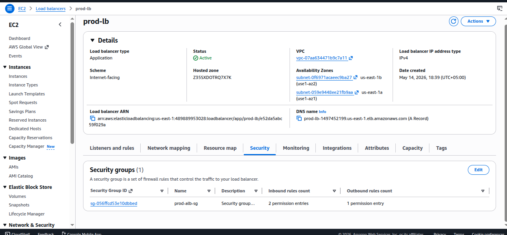
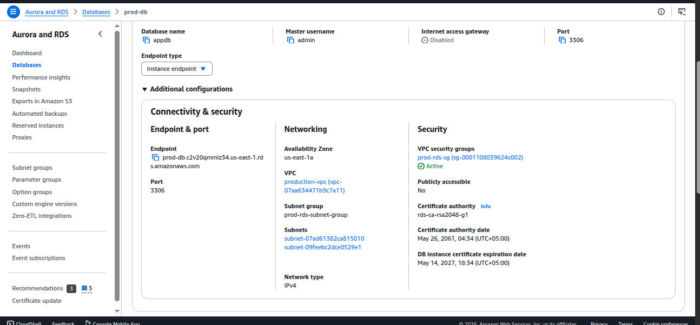

---

## 5. Application Load Balancer

Internet-facing ALB across both public subnets. Distributes traffic between both private EC2 instances.

```
Name:     prod-lb
Scheme:   Internet-facing
Subnets:  public-subnet-1 (us-east-1a), public-subnet-2 (us-east-1b)
SG:       alb-sg
Listener: HTTP port 80 → forward to prod-lb-tg

Target Group: prod-lb-tg
  Type:         Instance
  Protocol:     HTTP port 80
  Targets:      app-server-1, app-server-2
  Health check: HTTP GET /
```

During rolling deployment, ALB health checks detect when a container is restarting on one server and automatically routes all traffic to the other. Zero downtime.

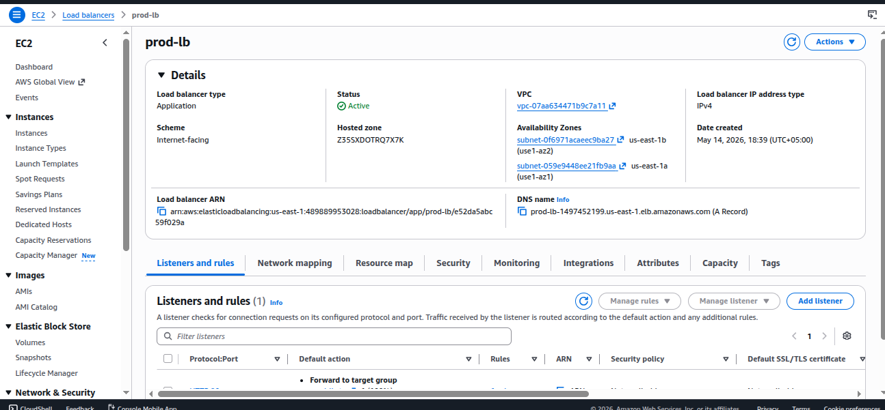
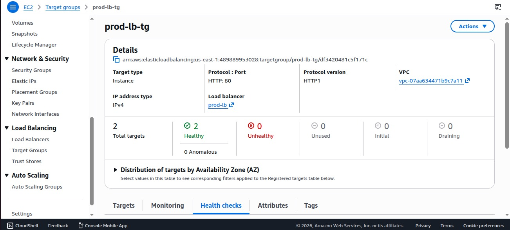

---

## 6. IAM Roles and OIDC

Two IAM roles. Zero static credentials anywhere in the pipeline.

### OIDC Provider

Allows GitHub Actions to authenticate with AWS using short-lived tokens instead of stored access keys. If your GitHub repo is ever compromised, there are no AWS keys to leak.

```
Provider URL:  https://token.actions.githubusercontent.com
Audience:      sts.amazonaws.com
```

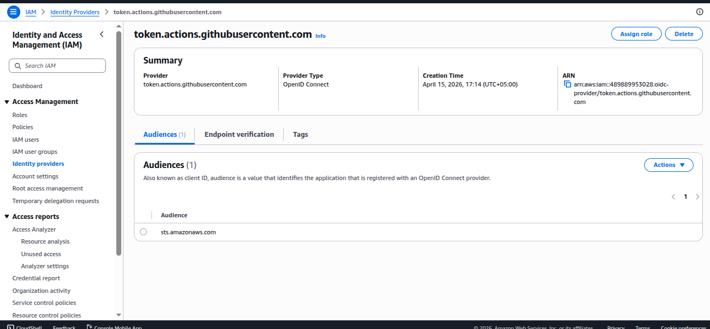

### Role 1 — shopix-githubaction-role

Used by GitHub Actions to push images to ECR and trigger deployments via SSM.

**Trust Relationship:**

```json
{
  "Version": "2012-10-17",
  "Statement": [
    {
      "Effect": "Allow",
      "Principal": {
        "Federated": "arn:aws:iam::<account-id>:oidc-provider/token.actions.githubusercontent.com"
      },
      "Action": "sts:AssumeRoleWithWebIdentity",
      "Condition": {
        "StringEquals": {
          "token.actions.githubusercontent.com:aud": "sts.amazonaws.com"
        },
        "StringLike": {
          "token.actions.githubusercontent.com:sub": "repo:asadbashir7755/Shopix_awscompleteproject:*"
        }
      }
    }
  ]
}
```

**Permissions Policy:**

```json
{
  "Version": "2012-10-17",
  "Statement": [
    {
      "Effect": "Allow",
      "Action": [
        "ecr:GetAuthorizationToken",
        "ecr:BatchCheckLayerAvailability",
        "ecr:PutImage",
        "ecr:InitiateLayerUpload",
        "ecr:UploadLayerPart",
        "ecr:CompleteLayerUpload"
      ],
      "Resource": "*"
    },
    {
      "Effect": "Allow",
      "Action": [
        "ssm:SendCommand",
        "ssm:GetCommandInvocation",
        "ssm:WaitUntilCommandExecuted"
      ],
      "Resource": "*"
    },
    {
      "Effect": "Allow",
      "Action": [
        "ec2:DescribeInstances"
      ],
      "Resource": "*"
    }
  ]
}
```

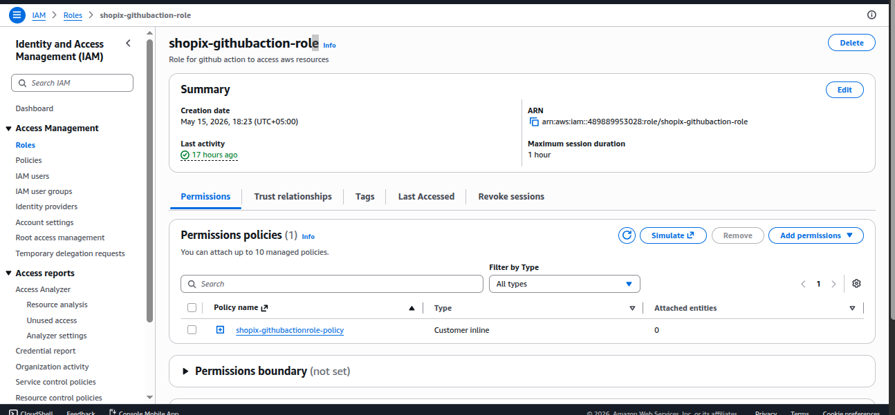

### Role 2 — ec2-ssm-role

Attached to both app servers. Allows EC2 to pull images from ECR and be managed by SSM.

```
Managed Policies:
  AmazonEC2ContainerRegistryReadOnly
  AmazonSSMManagedInstanceCore
```

Attached via: EC2 Console → Select instance → Actions → Security → Modify IAM Role → Select ec2-ssm-role

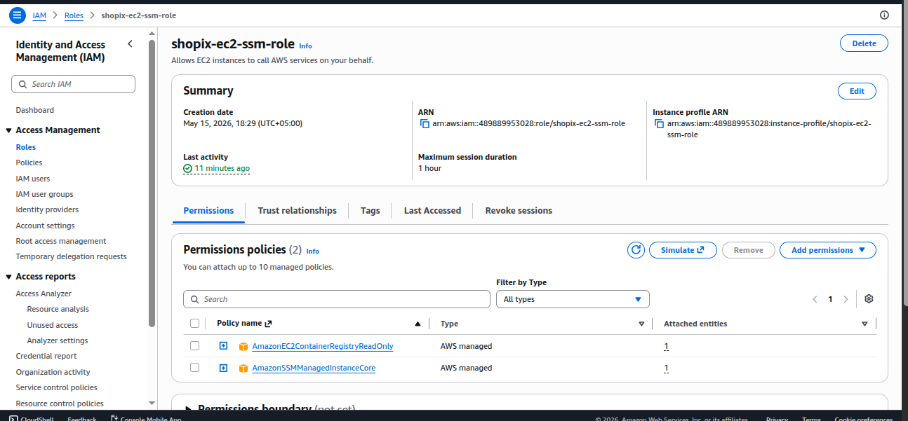

---

## 7. ECR — Container Registry

Private ECR repository stores all Docker images. Each deployment pushes two tags — git SHA for traceability and `latest` for the deployment command.

```
Repository: shopix
URI: <account-id>.dkr.ecr.us-east-1.amazonaws.com/shopix
Visibility: Private
Scan on push: Enabled
```

Image tags on every push:
```
shopix:<git-sha>   ← tied to exact commit, never overwritten
shopix:latest      ← always the newest image, EC2 pulls this
```

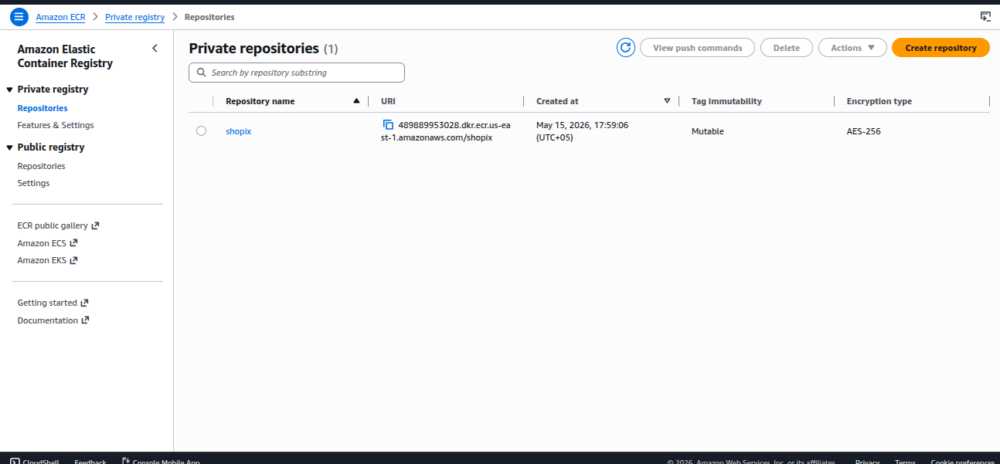

---

## 8. SSM — Systems Manager

SSM Fleet Manager shows both EC2 instances registered and online. This confirms SSM agent is running and the `ec2-ssm-role` is correctly attached.

**Why SSM instead of SSH for deployments?**

The SSH approach requires storing the private key in GitHub Secrets — if the repo is compromised, the key is exposed. SSM lets GitHub Actions send shell commands to private EC2 instances through the AWS API using the OIDC token. No open port 22 needed for CI/CD, no keys stored anywhere.

```
GitHub Actions
  → AWS API (authenticated via OIDC)
  → SSM SendCommand
  → Private EC2 (no public IP, no open SSH port)
  → Runs docker pull + docker run
```

The EC2 needs three things for SSM to work:
1. `ec2-ssm-role` attached with `AmazonSSMManagedInstanceCore`
2. SSM agent installed and running
3. Outbound internet via NAT Gateway to reach SSM API endpoints

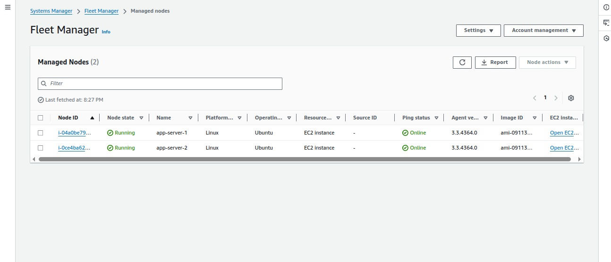

---

## 9. CI/CD Pipeline

### GitHub Secrets

These are added under: Repository → Settings → Secrets and Variables → Actions → New Repository Secret

```
AWS_ACCOUNT_ID                      → 12-digit AWS account ID
NEXT_PUBLIC_STRIPE_PUBLISHABLE_KEY  → Stripe publishable key (build-time)
NEXT_PUBLIC_PUSHER_KEY              → Pusher key (build-time)
NEXT_PUBLIC_PUSHER_CLUSTER          → Pusher cluster (build-time)
```

Runtime secrets like `DATABASE_URL`, `STRIPE_SECRET_KEY`, and `NEXTAUTH_SECRET` are stored in `/home/ubuntu/.env.production` directly on the EC2 instances and never go through GitHub.

**Why split between build-time and runtime secrets?**

Next.js `NEXT_PUBLIC_*` variables are embedded into the JavaScript bundle during `npm run build`. They must be available when Docker builds the image, so they are passed as `--build-arg`. All other secrets are only needed when the app is actually running, so they stay on the server in `.env.production` — safer and simpler.

### GitHub Actions Workflow

```yaml
name: Build and Deploy Shopix

on:
  push:
    branches:
      - main

env:
  AWS_REGION: us-east-1
  ECR_REPOSITORY: shopix

jobs:
  deploy:
    runs-on: ubuntu-latest
    permissions:
      id-token: write
      contents: read

    steps:
      - name: Checkout code
        uses: actions/checkout@v4

      - name: Configure AWS credentials via OIDC
        uses: aws-actions/configure-aws-credentials@v4
        with:
          role-to-assume: arn:aws:iam::${{ secrets.AWS_ACCOUNT_ID }}:role/shopix-githubaction-role
          aws-region: ${{ env.AWS_REGION }}

      - name: Login to ECR
        id: login-ecr
        uses: aws-actions/amazon-ecr-login@v2

      - name: Build and push image
        env:
          ECR_REGISTRY: ${{ steps.login-ecr.outputs.registry }}
          IMAGE_TAG: ${{ github.sha }}
        run: |
          docker build \
            --build-arg NEXT_PUBLIC_STRIPE_PUBLISHABLE_KEY=${{ secrets.NEXT_PUBLIC_STRIPE_PUBLISHABLE_KEY }} \
            --build-arg NEXT_PUBLIC_PUSHER_KEY=${{ secrets.NEXT_PUBLIC_PUSHER_KEY }} \
            --build-arg NEXT_PUBLIC_PUSHER_CLUSTER=${{ secrets.NEXT_PUBLIC_PUSHER_CLUSTER }} \
            -t $ECR_REGISTRY/$ECR_REPOSITORY:$IMAGE_TAG \
            -t $ECR_REGISTRY/$ECR_REPOSITORY:latest \
            .
          docker push $ECR_REGISTRY/$ECR_REPOSITORY:$IMAGE_TAG
          docker push $ECR_REGISTRY/$ECR_REPOSITORY:latest

      - name: Deploy to app-server-1
        env:
          ECR_REGISTRY: ${{ steps.login-ecr.outputs.registry }}
        run: |
          COMMAND_ID=$(aws ssm send-command \
            --region ${{ env.AWS_REGION }} \
            --targets "Key=tag:Name,Values=app-server-1" \
            --document-name "AWS-RunShellScript" \
            --parameters commands='[
              "aws ecr get-login-password --region us-east-1 | docker login --username AWS --password-stdin '$ECR_REGISTRY'",
              "docker pull '$ECR_REGISTRY'/${{ env.ECR_REPOSITORY }}:latest",
              "docker stop shopix || true",
              "docker rm shopix || true",
              "docker run -d --name shopix -p 80:3000 --restart always --env-file /home/ubuntu/.env.production '$ECR_REGISTRY'/${{ env.ECR_REPOSITORY }}:latest"
            ]' \
            --query "Command.CommandId" \
            --output text)

          aws ssm wait command-executed \
            --command-id $COMMAND_ID \
            --instance-id $(aws ec2 describe-instances \
              --filters "Name=tag:Name,Values=app-server-1" \
              --query "Reservations[0].Instances[0].InstanceId" \
              --output text)

      - name: Deploy to app-server-2
        env:
          ECR_REGISTRY: ${{ steps.login-ecr.outputs.registry }}
        run: |
          COMMAND_ID=$(aws ssm send-command \
            --region ${{ env.AWS_REGION }} \
            --targets "Key=tag:Name,Values=app-server-2" \
            --document-name "AWS-RunShellScript" \
            --parameters commands='[
              "aws ecr get-login-password --region us-east-1 | docker login --username AWS --password-stdin '$ECR_REGISTRY'",
              "docker pull '$ECR_REGISTRY'/${{ env.ECR_REPOSITORY }}:latest",
              "docker stop shopix || true",
              "docker rm shopix || true",
              "docker run -d --name shopix -p 80:3000 --restart always --env-file /home/ubuntu/.env.production '$ECR_REGISTRY'/${{ env.ECR_REPOSITORY }}:latest"
            ]' \
            --query "Command.CommandId" \
            --output text)

          aws ssm wait command-executed \
            --command-id $COMMAND_ID \
            --instance-id $(aws ec2 describe-instances \
              --filters "Name=tag:Name,Values=app-server-2" \
              --query "Reservations[0].Instances[0].InstanceId" \
              --output text)
```

### What Each Step Does

```
Set up job               → GitHub spins up a fresh Ubuntu runner
Checkout code            → pulls repo code onto the runner
Configure AWS via OIDC   → assumes shopix-githubaction-role using short-lived token, no keys
Login to ECR             → gets temporary ECR docker login token
Build and push image     → builds Next.js Docker image, pushes to ECR with SHA + latest tags
Deploy to app-server-1   → SSM sends docker commands to server-1, waits until confirmed done
Deploy to app-server-2   → same for server-2, only after server-1 is healthy
```

**Rolling deployment — why this order matters:**
ALB continuously health checks both servers. When server-1 container stops to be replaced, ALB detects it as unhealthy and sends all traffic to server-2. Once server-1 is back up and healthy, the pipeline then updates server-2 the same way. Users never hit a down server.

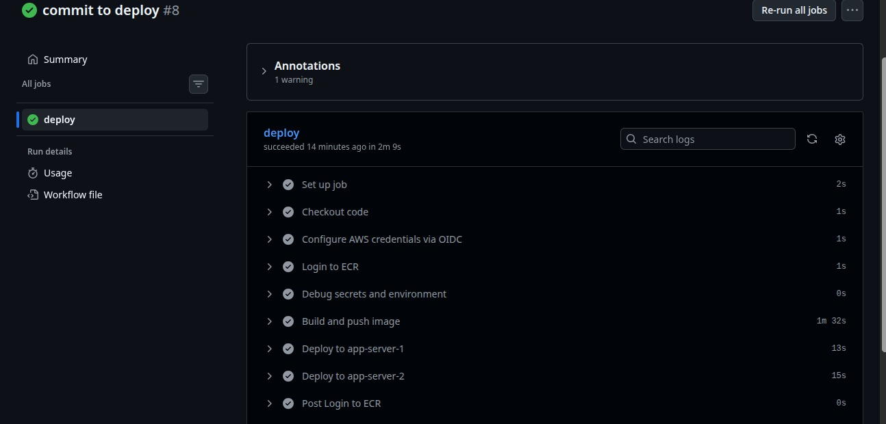

---

## 10. Issues Faced

### Issue 1 — OIDC Trust Relationship Wrong Repo Format

**Error:**
```
Error: Could not assume role with OIDC: Not authorized to perform sts:AssumeRoleWithWebIdentity
```

**Cause:** The `sub` condition in the trust relationship had the full GitHub URL pasted in instead of just `username/reponame`.

```json
// WRONG — full URL breaks the format
"repo:asadbashir7755/https://github.com/asadbashir7755/Shopix.git:ref:refs/heads/main"

// CORRECT — just username/reponame with wildcard
"repo:asadbashir7755/Shopix_awscompleteproject:*"
```

**Fix:** Edit trust relationship in IAM. Use only `username/reponame` format with `*` at the end.

---

### Issue 2 — Docker Build Failing With No Arguments Error

**Error:**
```
ERROR: docker: 'docker buildx build' requires 1 argument
```

**Cause:** Top-level `env` variables in GitHub Actions are not automatically exported as shell environment variables inside `run` blocks. Writing `$ECR_REGISTRY` in the shell failed because that variable was never set in the shell environment.

**Fix:** Declare `ECR_REGISTRY` at the step level using the output from the ECR login action, not constructed manually.

```yaml
# WRONG — top-level env not usable as shell variable in run blocks
env:
  ECR_REGISTRY: ${{ secrets.AWS_ACCOUNT_ID }}.dkr.ecr.us-east-1.amazonaws.com

# CORRECT — step-level env from the actual action output
- name: Build and push image
  env:
    ECR_REGISTRY: ${{ steps.login-ecr.outputs.registry }}
```

---

### Issue 3 — Hardcoded AWS Account ID in Workflow

**Problem:** AWS account ID was written directly in the workflow file. Sensitive value in source code — bad practice.

**Fix:** Added `AWS_ACCOUNT_ID` as a GitHub Secret. Referenced as `${{ secrets.AWS_ACCOUNT_ID }}` everywhere in the workflow. Account ID never appears in the codebase.

---

### Issue 4 — RDS "Connect to EC2" Console Option

**Problem:** RDS console shows a "Connect to EC2 compute resource" option that looks convenient but only works for one EC2 and creates auto-generated security groups that are hard to control and understand.

**Fix:** Selected "Don't connect to EC2 compute resource" and manually created `rds-sg` with `ec2-sg` as the inbound source. Both app servers get database access automatically because they both have `ec2-sg` attached.

---

### Issue 5 — SSM Agent Not Pre-installed on Ubuntu

**Problem:** Amazon Linux 2023 has SSM agent pre-installed and running by default. Ubuntu does not. Both EC2 instances were not appearing in SSM Fleet Manager after attaching `ec2-ssm-role`.

**Fix:**

```bash
sudo snap install amazon-ssm-agent --classic
sudo systemctl enable snap.amazon-ssm-agent.amazon-ssm-agent.service
sudo systemctl start snap.amazon-ssm-agent.amazon-ssm-agent.service
```

After this both instances appeared in Fleet Manager as Online.

---

## 11. Tech Stack

| Layer | Technology |
|---|---|
| Application | Next.js 14 (App Router — frontend + backend combined) |
| Containerization | Docker (multi-stage build: deps → build → runner) |
| Container Registry | Amazon ECR (private) |
| Compute | Amazon EC2 — Ubuntu 22.04, t2.micro |
| Database | Amazon RDS — MySQL 8.0, db.t3.micro |
| Load Balancer | AWS Application Load Balancer |
| Networking | Custom VPC, 6 subnets, IGW, NAT Gateway, Route Tables |
| CI/CD | GitHub Actions |
| AWS Authentication | OIDC — zero static credentials |
| Remote Deployment | AWS Systems Manager SSM |
| Payments | Stripe |
| Real-time | Pusher |

---

## 12. Key Concepts Demonstrated

- **Multi-AZ deployment** — EC2 and RDS both span us-east-1a and us-east-1b. One AZ going down does not take the app down.
- **Network isolation** — App servers and database live in private subnets. Zero direct internet exposure. All inbound traffic goes through ALB only.
- **Zero-credential CI/CD** — OIDC eliminates the need to store any AWS keys in GitHub. Short-lived tokens only, nothing to leak.
- **Agentless remote deployment** — SSM replaces SSH for CI/CD. No private keys in GitHub, no port 22 open for the pipeline.
- **Rolling deployment** — app-server-1 updates and is confirmed healthy before app-server-2 starts updating. ALB routes around the server being updated. Zero downtime.
- **Least privilege IAM** — GitHub Actions role can only push to ECR and send SSM commands. EC2 role can only pull from ECR and be managed by SSM. Nothing more than what each needs.
- **Multi-stage Docker build** — separate stages for installing dependencies, building the Next.js app, and the final runner. The production image contains only what is needed to run, nothing from build time.
- **Build-time vs runtime secrets** — Next.js public variables baked into the bundle via Docker build args. All sensitive runtime secrets live only on EC2 in `.env.production`, never in GitHub.
- **Security group chaining** — ALB → EC2 → RDS access controlled entirely by security group references. Clean, scalable, no IP management.

---

## Author

**Asad Bashir** — DevOps Engineer

- GitHub: [github.com/asadbashir7755](https://github.com/asadbashir7755)
- LinkedIn: [linkedin.com/in/asad-bashir-772b73299](https://www.linkedin.com/in/asad-bashir-772b73299)
- Portfolio: [committodeploy.dev](https://committodeploy.dev)
- Email: asadbashir2229526@gmail.com