# 🚀 Shopix Platform Functionalities

Welcome to the feature overview of the Shopix eCommerce Platform. This document deeply outlines the core and advanced functionalities of the project, segregated by user roles: **Customer**, **Seller**, and **Admin**. 

We heavily focus on delivering a high-quality, feature-complete B2B and B2C eCommerce experience out-of-the-box utilizing Next.js (App Router), Node ecosystem, and Real-Time websockets.

## 👤 Customer Functionalities

Customers are the end-users who browse, interact with, and purchase products from various stores on the platform.

### Core Features
- **Authentication & Security:** Secure Signup, Login, and Password Reset (forgot password capabilities via email).
- **Product Marketplace:** Explore products globally sourced from various approved sellers.
- **Dynamic Product Pages:** Detailed product views showcasing image galleries, seller information, and specifications.
- **Wishlist & Save:** Save favorite products to a dedicated wishlist for later consideration.
- **Shopping Cart:** Add products, update quantities, and view a summary of the cart before checkout.
- **Checkout & Payment Integration:** Seamless, secure checkout using Stripe integration with support for COD and Online methods.

### In-App Notification & Chat Systems
- **Real-Time Live Chat:** An integrated real-time instant chat functionality powered by Pusher. Customers can chat directly with Sellers about custom orders, product availabilities, and general inquiries in a floating Messenger UI interface. 
- **Real-time Updates:** Bell icon with unread count badge in Navbar.
- **Event Triggers:** Automated notifications for:
    - Order placements and status changes (Shipped/Delivered).
    - Return requests and seller decisions.

### Advanced Features
- **Masonry Bento-Grid Homepage:** The product listing dynamically adapts a beautiful programmatic masonry/bento-grid display spanning mixed layouts depending on screen sizes for maximum visual aesthetics.
- **Order Tracking:** Track the status of active and historical orders (Pending, Shipped, Delivered) via the "My Orders" dashboard.
- **Returns System:** Request returns for delivered items out of the box, directly communicating with the seller.
- **Product Reviews & Ratings:** Leave comments and 1-5 star ratings on products purchased to inform the community.
- **Wishlist to Cart:** Seamlessly transition saved items from wishlist to cart for immediate purchase.
- **AI Chatbot Assistant:** Get instant support via a floating global AI chatbot trained to address generic shopping and platform questions.
- **Real-Time Email Notifications:** Receive stylized transactional emails (using custom HTML templates) for order confirmations, shipping updates, and return approvals/rejections.

---

## 🏬 Seller Functionalities

Sellers are merchants utilizing the platform to manage their business, list inventory, and fulfill orders.

### Core Features
- **Store Application:** Sellers must submit an application with store details for administrative approval before selling.
- **Inventory Management:** Full CRUD (Create, Read, Update, Delete) access to their localized catalog with Cloudinary Image Uploads integrated seamlessly.
- **Seller Dashboard:** High-level metrics on store performance, total revenue, and product counts.
- **Order Fulfillment:** Secure dashboard to view incoming orders and customer shipping details.

### Advanced Features
- **Interactive Multi-channel Dashboard:** Sellers possess a comprehensive messaging interface to organize incoming live chats with buyers directly in their dashboard.
- **Order Status Controls:** Manually update order statuses (Processing, Shipped, Delivered) that trigger automated tracking emails to customers.
- **Return Management:** Interface to review, approve, or reject customer return requests based on reasonings and store policy.
- **Analytics & Recharts:** Visual representations of sales trends and order volumes natively rendered via the Recharts library.
- **Immediate Alerting:** Real-time email notifications for new incoming sales or critical admin actions regarding their store.

---

## 🛡️ Admin Functionalities

Administrators oversee the entire marketplace, maintain quality control, and enforce platform guidelines.

### Core Features
- **Global Dashboard:** Master view providing macroscopic insights, total active users, gross product counts, and platform-wide revenue volume.
- **User Management:** List, scrutinize, or delete disruptive users from the platform with split views for Customers vs. Sellers.

### Advanced Features
- **Store Vetting System:** A queue of "Pending Stores" requiring explicit Administrator approval or rejection (with provided reasoning).
- **Store Moderation & Freezing:** Admins possess the ability to "Freeze" an active store for policy violations, instantly revoking its public marketplace visibility.
- **Global Inventory Override:** Administrators can view detailed inner workings of any store and forcefully delete specific unauthorized or illegal products.
- **System Administration Emails:** Automated oversight emails pushed to administrators when new stores request platform access.

---

## 🛠️ Shared/Global Ecosystem Integrations

These are built-in features active behind the scenes across all scopes of the project:
- **Robust Database Seeder Environment:** Developers can trigger `npm run seed` to instantly forge an artificial, massive test base with 50+ populated customers, simulated conversations, functional dynamic stores, wishlists, and orders using FakerJS.
- **Rate Limiting Security Engine:** Sensitive endpoints (Authentication routes and Payment creation) are fortified behind Upstash Redis implementation against brutal automated requests.
- **Automated Swagger API Specifications:** Developers can view autogenerated Open API specs explicitly at `/docs` reflecting real-time backend updates.
- **Production Reliability & Testing:** Integrated unit testing (Jest), End-to-End testing (Playwright), and real-time error tracking (Sentry).
- **Docker Ready:** Built-in multi-stage `Dockerfile` and `docker-compose.yml` configs ensure 5-minute cold bootstraps for containerized deployment hosting.
- **Tokenized JWT Guards:** Unauthorized access attempts to protected dashboard screens are properly handled natively by deep Next-Auth session intercepts.

---

## 📸 Screenshots

Here is a visual overview of the Shopix platform's core interfaces:

### 🏠 Homepage
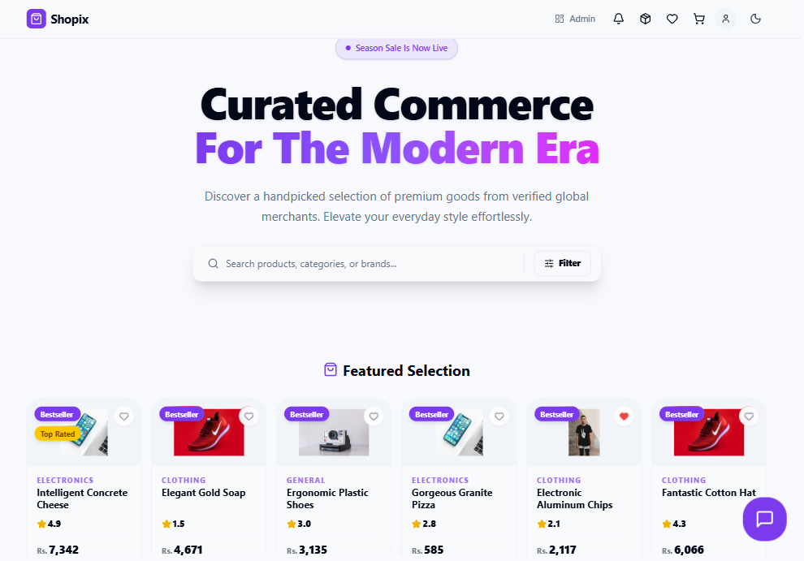
*A beautiful masonry and bento-grid display showcase of the global product marketplace.*

### 🤖 AI Chatbot Assistant
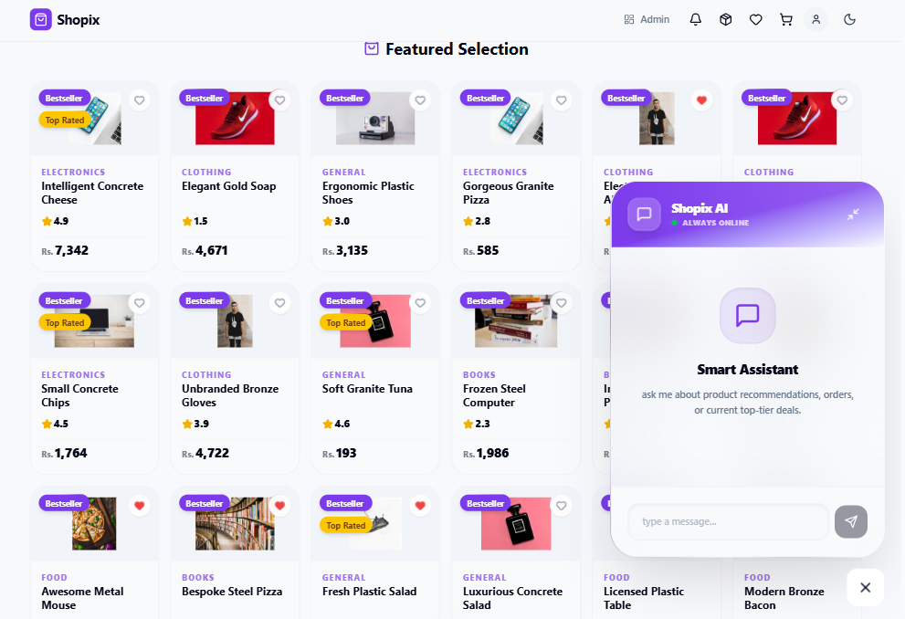
*Instant support assistant trained to help users navigate shopping and platform inquiries.*

### 🛒 Wishlist Page
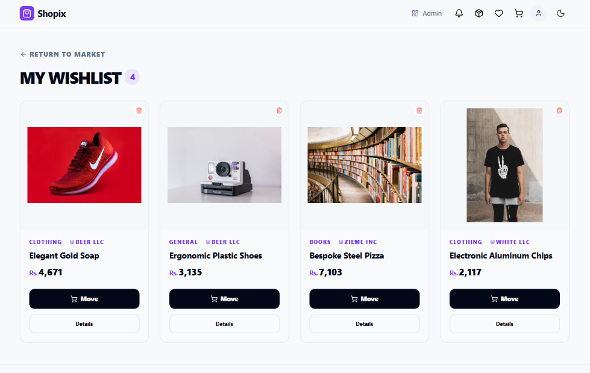
*A dedicated space for users to save and manage their favorite products for later purchase.*

### 👤 User Profile
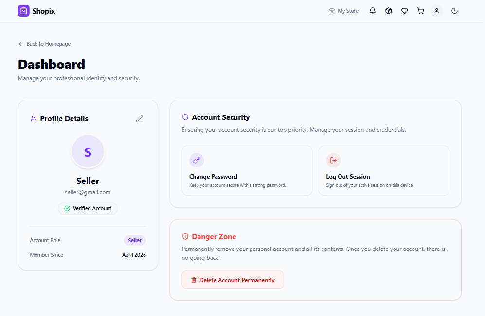
*A centralized dashboard for customers to manage their account details and settings.*

### 📝 Checkout & Order Form

*Seamless and secure checkout interface for completing product purchases.*

### 🔔 Real-time Notifications
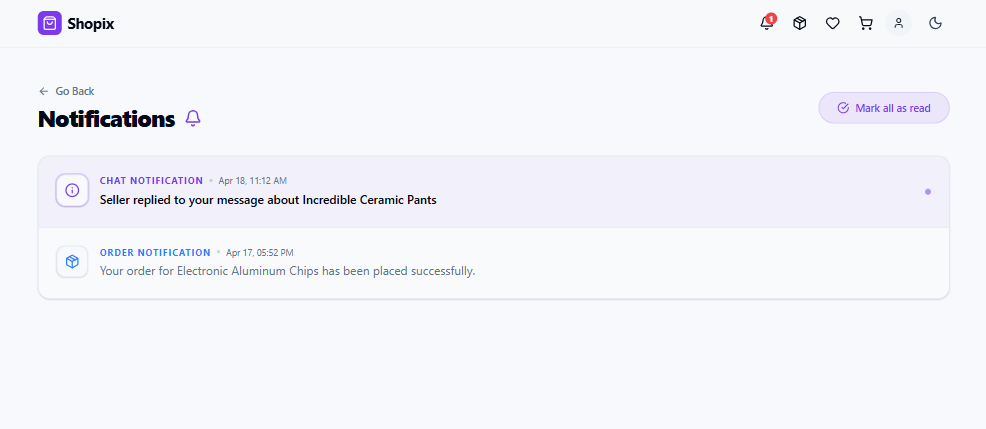
*Integrated notification system providing real-time updates on orders and account activities.*

### 💬 Live Chat with Seller
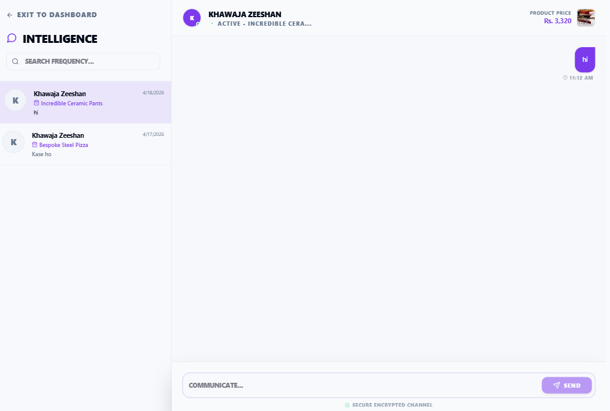
*Instant messaging interface allowing direct communication between buyers and sellers.*

### 📊 Seller Store Dashboard
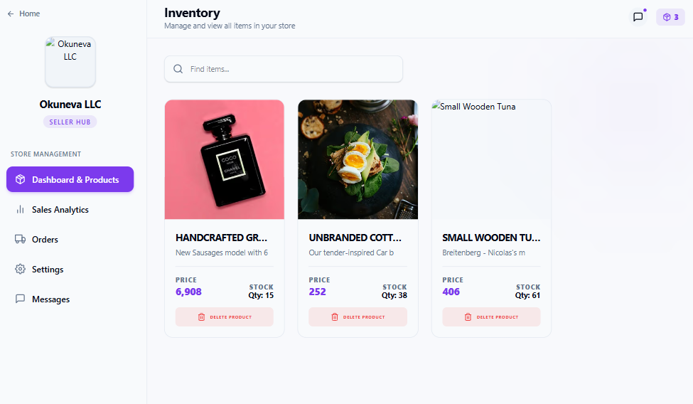
*Comprehensive merchant dashboard for managing inventory, orders, and store performance.*

### 📈 Sales Analytics
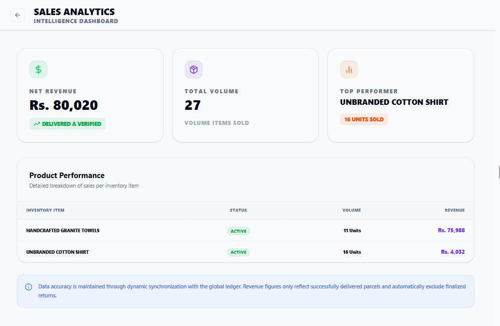
*Visualized data insights and trends regarding store revenue and order volume.*

### 🛡️ Admin Global Dashboard
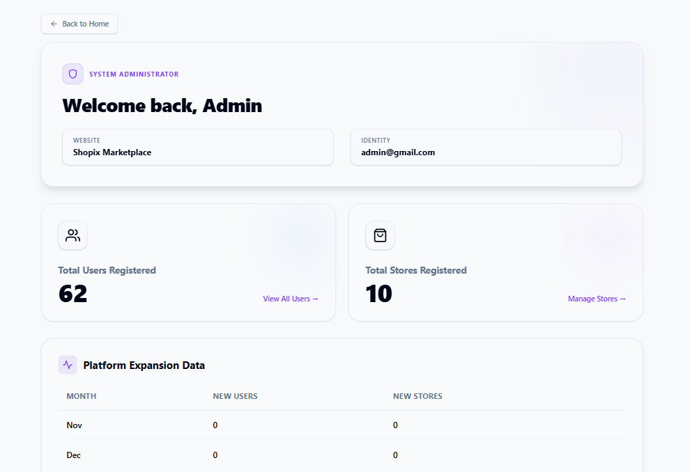
*Master oversight panel providing macroscopic insights into platform-wide activity and revenue.*

### 👥 Admin User Management
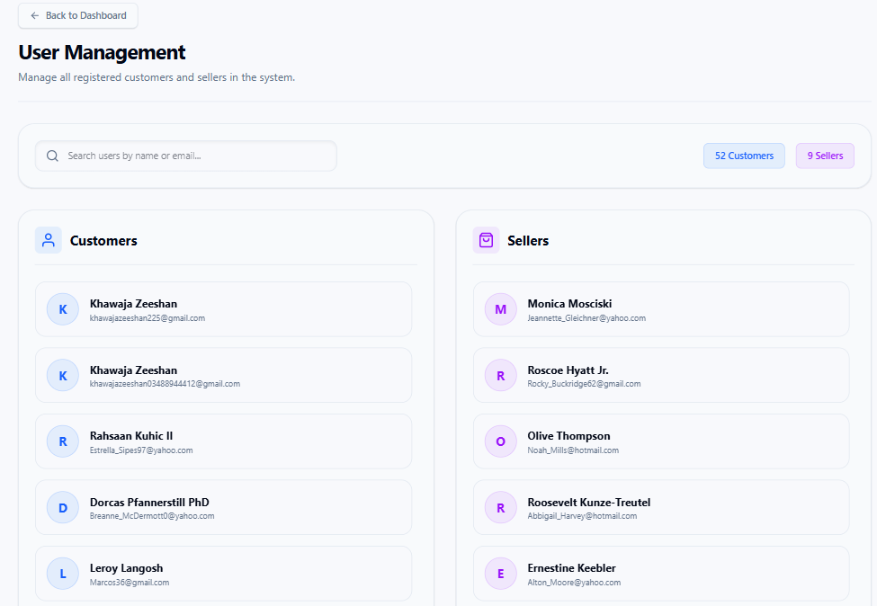
*Dedicated interface for administrators to moderate and manage the platform's user base.*

### 🏬 Admin Store Management
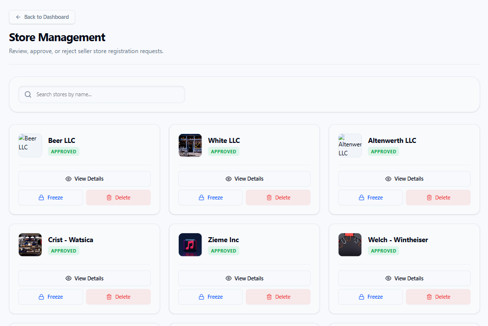
*Tools for administrators to oversee store statuses and enforce platform guidelines.*

### 📋 Admin Store Review
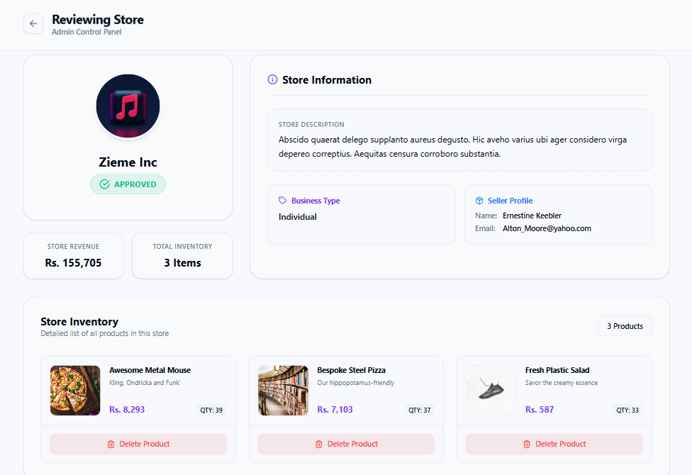
*Vetting interface for administrators to evaluate and approve or reject new store applications.*

